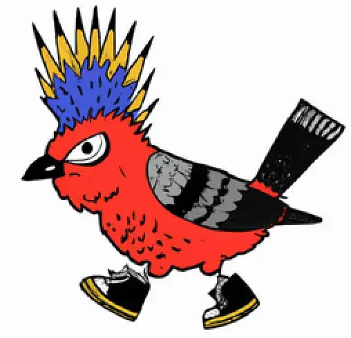

<a name="readme-top"></a>

<!-- STATUS BADGES -->

[](https://app.netlify.com/sites/willowy-kheer-7c8f81/deploys)

<!-- PROJECT HEADING -->
<br />
<div align="center">
  <a href="https://github.com/justintsugranes/">
    
  </a>
</div>

### [Fender Rewards Program][project-url]

The Fender Rewards Program is a simple full-stack application built using JavaScript, HTML, and CSS for the frontend and Node.js / Express.js for the server. The frontend is hosted on Netlify. The backend is hosted on Heroku. The application utilizes MongoDB Atlas as the database. It's meant to test the functionality of a hypotethical rewards program for Fender Digital.

[Explore the docs][repo-url] --- [View Demo][project-url] --- [Report Bug][issues-url]

<!-- TABLE OF CONTENTS -->
<details>
  <summary>Table of Contents</summary>
  <ol>
    <li>
      <a href="#about-the-project">About The Project</a>
      <ul>
        <li><a href="#built-with">Built With</a></li>
      </ul>
    </li>
    <li>
      <a href="#getting-started">Getting Started</a>
      <ul>
        <li><a href="#prerequisites">Prerequisites</a></li>
        <li><a href="#installation">Installation</a></li>
      </ul>
    </li>
    <li><a href="#usage">Usage</a></li>
    <li><a href="#license">License</a></li>
    <li><a href="#contact">Contact</a></li>
  </ol>
</details>

## About The Project

[![Project Screen Shot][project-screenshot]][project-url] [![Contributors][contributors-shield]][contributors-url] [![Forks][forks-shield]][forks-url] [![Stargazers][stars-shield]][stars-url] [![Issues][issues-shield]][issues-url] [![MIT License][license-shield]][license-url]

At this stage, the Fender Rewards Program is in its early development phase and focuses on creating a basic structure for a rewards program. The current implementation does not include any extensive features.

The purpose of the application is to test the logic for managing a loyalty program where users can earn points for specific actions, such as purchases and achievements and redeem points.

The project is just in the beginning stages and the initial version includes the foundational setup and basic functionality. Future iterations will involve the integration of additional features, such as the points redemption algorithm, data management, user interactions, and testing.

_I'd love to hear any feedback or just thoughts. Feel free to reach out at my contact info below. Cheers!_

### Built With

#### Frontend

<!-- - **Web** -->

[![javascript]][javascript-url]
[![html]][html-url]
[![css]][css-url]

<!-- - **UI/UX / Graphic Design** -->
  <!-- [![figma]][figma-url] -->

#### Backend / API

[![node]][node-url]
[![express]][express-url]
[![postman]][postman-url]
[![mongodb]][mongodb-url]
[![swagger]][swagger-url]

#### Deployment / Hosting

[![heroku]][heroku-url]
[![netlify]][netlify-url]

#### Security / Auth / Encryption

<!-- [jwt] -->
<!-- [google-auth] -->
<!-- [bcrypt] -->
<!-- [nanoid -->
<!-- [uuid] -->

[dotenv](https://www.npmjs.com/package/dotenv)

#### Testing

[![cypress]][cypress-url]
[![jest]][jest-url]

<!-- #### Misc Packages -->

[concurrently](https://www.npmjs.com/package/concurrently)
[nodemon](https://nodemon.io/)
[node-cron](https://www.npmjs.com/package/node-cron)

<!-- TODO: UPDATE INFO -->

## Getting Started

To get started with the Fender Rewards Program, follow the instructions below:

### Prerequisites

Make sure you have the following installed on your machine:

- Node.js
- npm (Node Package Manager)

  ```sh
  npm i npm@latest -g
  ```

### Installation

1. Clone the repository:

   ```sh
   git clone https://github.com/justintsugranes/project_fender-rewards.git
   ```

2. Install NPM packages

   ```sh
   npm i
   ```

3. Create a .env in `/server/config/`

4. Create a your MONGODB_URI

   ```sh
   MONGODB_URI = "ENTER YOUR URI"
   ```

5. cd into root directory

   ```sh
   npm start
   ```

## Usage

From the frontend, you can get a user by id, add points to a user, and redeem points for a user.

_For more examples, please refer to the [Documentation][repo-url]_

### Folder Structure

```md
/root
├── client
│ ├── public
│ │ ├── css
│ │ │ └── styles.css
│ │ ├── img
│ │ ├── js
│ │ │ └── client.js
│ │ ├── index.html
│ │ ├── notes.html
│ │ └── prompt.html
│ ├── .gitignore
│ ├── package-lock.json
│ ├── package.json
│ └── README.md
├── server
│ ├── config
│ │ ├── .env
│ │ ├── .env.production
│ │ └── dbConfig.js
│ ├── controllers
│ │ ├── index.js
│ │ └── user.controller.js
│ ├── models
│ │ ├── index.js
│ │ └── user.model.js
│ ├── routes
│ │ ├── index.js
│ │ └── user.routes.js
│ ├── services
│ │ ├── index.js
│ │ └── user.service.js
│ ├── swagger
│ │ ├── swagger.css
│ │ ├── swaggerDef.js
│ │ └── swaggerOptions.js
│ ├── .gitignore
│ ├── package-lock.json
│ ├── package.json
│ ├── Procfile
│ ├── README.md
│ └── server.js
├── tests
│ ├── unit
│ │ ├── user.controller.test.js
│ │ ├── user.model.test.js
│ │ ├── user.routes.test.js
│ │ └── user.service.test.js
│ └── e2e
│ └── e2e.test.js
├── .gitignore
├── cypress.config.js
├── jest.config.js
├── package-lock.json
├── package.json
├── node_modules
└── README.md
```

## Features

### Frontend Features

1. Built framework free using just JavaScript, HTML, and CSS
2. Get User, Earn Points, and Redeem Points functions
3. Hosted on Netlify

### Backend Features

1. Node.js and Express server
2. Follows MVP pattern
3. Hosted on Heroku
4. Connected to MongoDB Atlas Backend
5. Swagger documentation

See the [open issues][issues-url] for a full list of proposed features (and known issues).

## License

Distributed under the [MIT License][license-url]. See `LICENSE.md` for more information.

## Contact

- [Email](mailto:justinjontsugranes@gmail.com?subject=Hi%2C%20from%20GitHub%21')
- [Website](https://justintsugranes.com)
- [GitHub @justintsugranes](https://github.com/justintsugranes 'Justin Tsugranes')
- [LinkedIn @justin-tsugranes](https://linkedin.com/in/justin-tsugranes)

## 🤝 Support

Give a ⭐️ if you like this project and if you like my work, maybe you would like to

<a href="https://www.buymeacoffee.com/tsugranes" target="_blank"></a>

<!-- ## Acknowledgments

- []() -->

<p align="right">(<a href="#readme-top">back to top</a>)</p>

---

<!-- LINK & IMAGE VARIABLES -->
<!-- https://www.markdownguide.org/basic-syntax/#reference-style-links -->

[project-screenshot]: images/project-screenshot.webp
[project-url]: https://fender-rewards.netlify.app/
[repo-url]: https://github.com/justintsugranes/project_fender-rewards.git
[contributors-shield]: https://img.shields.io/github/contributors/justintsugranes/project_fender-rewards.svg?style=for-the-badge
[contributors-url]: https://github.com/justintsugranes/project_fender-rewards/graphs/contributors
[forks-shield]: https://img.shields.io/github/forks/justintsugranes/project_fender-rewards.svg?style=for-the-badge
[forks-url]: https://github.com/justintsugranes/project_fender-rewards/network/members
[stars-shield]: https://img.shields.io/github/stars/justintsugranes/project_fender-rewards.svg?style=for-the-badge
[stars-url]: https://github.com/justintsugranes/project_fender-rewards/stargazers
[issues-shield]: https://img.shields.io/github/issues/justintsugranes/project_fender-rewards.svg?style=for-the-badge
[issues-url]: https://github.com/justintsugranes/project_fender-rewards/issues
[license-shield]: https://img.shields.io/github/license/justintsugranes/project_fender-rewards.svg?style=for-the-badge
[license-url]: https://github.com/justinTsugranes/project_fender-rewards/blob/main/LICENSE.md

<!-- TECH SHIELD VARIABLES -->

<!-- WEB LANGUANGES /  LIBRARIES / FRAMEWORKS -->

[javascript]: https://img.shields.io/badge/JavaScript-F7DF1E?style=for-the-badge&logo=javascript&logoColor=white
[javascript-url]: https://developer.mozilla.org/en-US/docs/Web/JavaScript

<!-- UI / CSS LIBRARIES -->

[html]: https://img.shields.io/badge/HTML5-e34f26?style=for-the-badge&logo=html5&logoColor=white
[html-url]: https://developer.mozilla.org/en-US/docs/Glossary/HTML5
[css]: https://img.shields.io/badge/CSS3-1572B6?style=for-the-badge&logo=css3&logoColor=white
[css-url]: https://developer.mozilla.org/en-US/docs/Web/CSS

<!-- API -->

[express]: https://img.shields.io/badge/Express.js-000000?style=for-the-badge&logo=express&logoColor=white
[express-url]: https://expressjs.com/
[node]: https://img.shields.io/badge/Node.Js-2343853?style=for-the-badge&logo=node.js&logoColor=white
[node-url]: https://nodejs.org/
[postman]: https://img.shields.io/badge/Postman-FF6C37?style=for-the-badge&logo=postman&logoColor=white
[postman-url]: https://www.postman.com/

<!-- DATABASE -->

[mongodb]: https://img.shields.io/badge/MongoDB-47A248?style=for-the-badge&logo=mongodb&logoColor=white
[mongodb-url]: https://www.mongodb.com/home

<!-- [mongoose]: https://mongoosejs.com/docs/ -->

<!-- AUTH / SECURITY-->

<!-- [bcrypt]: https://www.npmjs.com/package/bcrypt -->
<!-- [jwt]: https://jwt.io/ -->
<!-- [nanoid]:  -->
<!-- [uuid]:  -->

<!-- TESTING -->

[cypress]: https://img.shields.io/badge/Cypress-17202C?style=for-the-badge&logo=cypress&logoColor=white
[cypress-url]: https://www.cypress.io/
[jest]: https://img.shields.io/badge/Jest-C21325?style=for-the-badge&logo=jest&logoColor=white
[jest-url]: https://jestjs.io/

<!-- HOSTING / DEPLOYMENT -->

[heroku]: https://img.shields.io/badge/Heroku-563D7C?style=for-the-badge&logo=heroku&logoColor=white
[heroku-url]: https://www.heroku.com/
[netlify]: https://img.shields.io/badge/Netlify-00C7B7?style=for-the-badge&logo=netlify&logoColor=white
[netlify-url]: https://www.netlify.com/
